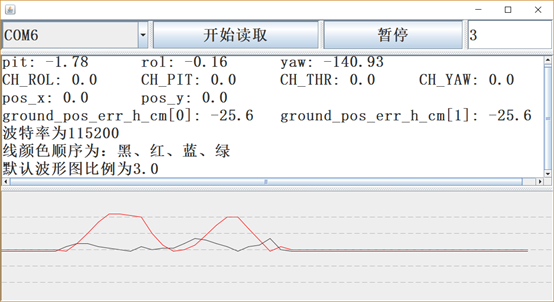

在单片机中添加如下程序：

* 每100ms发送一次
```c
static u8 my_data_to_send[50];	//发送数据缓存
static void Loop_Task_10(void)	//100ms执行一次
{
	u8 _cnt = 0;
	u16 t_pit = (u16)(imu_data.pit*100+18000);
	u16 t_rol = (u16)(imu_data.rol*100+18000);
	u16 t_yaw = (u16)(imu_data.yaw*100+18000);
	my_data_to_send[_cnt++]=0xaa;
	// 飞控三个角
    my_data_to_send[_cnt++]=t_pit/256;
    my_data_to_send[_cnt++]=t_pit%256;
    my_data_to_send[_cnt++]=t_rol/256;
    my_data_to_send[_cnt++]=t_rol%256;
    my_data_to_send[_cnt++]=t_yaw/256;
    my_data_to_send[_cnt++]=t_yaw%256;
    // 飞控遥控器输出
    my_data_to_send[_cnt++]=CH_N[CH_ROL]/256;
    my_data_to_send[_cnt++]=CH_N[CH_ROL]%256;
    my_data_to_send[_cnt++]=CH_N[CH_PIT]/256;
    my_data_to_send[_cnt++]=CH_N[CH_PIT]%256;
    my_data_to_send[_cnt++]=CH_N[CH_THR]/256;
    my_data_to_send[_cnt++]=CH_N[CH_THR]%256;
    my_data_to_send[_cnt++]=CH_N[CH_YAW]/256;
    my_data_to_send[_cnt++]=CH_N[CH_YAW]%256;
    // 飞控openmv相关数据
    my_data_to_send[_cnt++]=opmv.cb.pos_x/256;
    my_data_to_send[_cnt++]=opmv.cb.pos_x%256;
    my_data_to_send[_cnt++]=opmv.cb.pos_y/256;
    my_data_to_send[_cnt++]=opmv.cb.pos_y%256;
    my_data_to_send[_cnt++]=(int)(ano_opmv_cbt_ctrl.ground_pos_err_h_cm[0]*100)/256;
    my_data_to_send[_cnt++]=(int)(ano_opmv_cbt_ctrl.ground_pos_err_h_cm[0]*100)%256;
    my_data_to_send[_cnt++]=(int)(ano_opmv_cbt_ctrl.ground_pos_err_h_cm[1]*100)/256;
    my_data_to_send[_cnt++]=(int)(ano_opmv_cbt_ctrl.ground_pos_err_h_cm[1]*100)%256;
    my_data_to_send[_cnt++]=(int)(fs.speed_set_h[X]*100)/256;
    my_data_to_send[_cnt++]=(int)(fs.speed_set_h[X]*100)%256;
    my_data_to_send[_cnt++]=(int)(fs.speed_set_h[Y]*100)/256;
    my_data_to_send[_cnt++]=(int)(fs.speed_set_h[Y]*100)%256;
    // 飞控电机相关数据
    my_data_to_send[_cnt++]=(int)(motor[0])/256;
    my_data_to_send[_cnt++]=(int)(motor[0])%256;
    my_data_to_send[_cnt++]=(int)(motor[1])/256;
    my_data_to_send[_cnt++]=(int)(motor[1])%256;
    my_data_to_send[_cnt++]=(int)(motor[2])/256;
    my_data_to_send[_cnt++]=(int)(motor[2])%256;
    my_data_to_send[_cnt++]=(int)(motor[3])/256;
    my_data_to_send[_cnt++]=(int)(motor[3])%256;
    my_data_to_send[_cnt++]=(int)(mc.ct_val_thr)/256;
    my_data_to_send[_cnt++]=(int)(mc.ct_val_thr)%256;
    my_data_to_send[_cnt++]=(int)(mc.ct_val_yaw)/256;
    my_data_to_send[_cnt++]=(int)(mc.ct_val_yaw)%256;
    my_data_to_send[_cnt++]=(int)(mc.ct_val_rol)/256;
    my_data_to_send[_cnt++]=(int)(mc.ct_val_rol)%256;
    my_data_to_send[_cnt++]=(int)(mc.ct_val_pit)/256;
    my_data_to_send[_cnt++]=(int)(mc.ct_val_pit)%256;
    my_data_to_send[_cnt++]=wcz_hei_fus.out;
    my_data_to_send[_cnt++]=0xfe;
	// 串口发送函数，见下面代码
	Drv_Uart5SendBuf(my_data_to_send, _cnt);
}
```

* 单片机串口初始化

```c
u8 U5TxDataTemp[256];
u8 U5TxInCnt = 0;
u8 U5TxOutCnt = 0;
void UART5_IRQHandler(void)
{
	uint8_t com_data;
	/*获取中断标志 原始中断状态 不屏蔽中断标志*/		
	uint32_t flag = ROM_UARTIntStatus(UART2_BASE,1);
	/*清除中断标志*/	
	ROM_UARTIntClear(UART2_BASE,flag);		
	/*判断FIFO是否还有数据*/		
	while(ROM_UARTCharsAvail(UART2_BASE))		
	{			
		com_data=ROM_UARTCharGet(UART2_BASE);
		//ANO_DT_Data_Receive_Prepare(com_data);
	}
	if(flag & UART_INT_TX)
	{
		Drv_Uart5TxCheck();
	}
}
void Drv_Uart5Init(uint32_t baudrate)
{
	ROM_SysCtlPeripheralEnable(SYSCTL_PERIPH_UART2);
	ROM_SysCtlPeripheralEnable(SYSCTL_PERIPH_GPIOD);
	
	/*PD7解锁操作*/
	HWREG(UART2_PORT + GPIO_O_LOCK) = GPIO_LOCK_KEY; 
	HWREG(UART2_PORT + GPIO_O_CR) = UART2_PIN_TX;
	HWREG(UART2_PORT + GPIO_O_LOCK) = 0x00;
	/*GPIO的UART模式配置*/
	ROM_GPIOPinConfigure(UART2_RX);
	ROM_GPIOPinConfigure(UART2_TX);
	ROM_GPIOPinTypeUART(UART2_PORT, UART2_PIN_TX | UART2_PIN_RX);
	/*配置串口号波特率和时钟源*/		
	ROM_UARTConfigSetExpClk(UART2_BASE, ROM_SysCtlClockGet(), baudrate,(UART_CONFIG_WLEN_8 | UART_CONFIG_STOP_ONE | UART_CONFIG_PAR_NONE));
	/*FIFO设置*/
	ROM_UARTFIFOLevelSet(UART2_BASE,UART_FIFO_TX7_8,UART_FIFO_RX7_8);
	ROM_UARTFIFOEnable(UART2_BASE);
	/*使能串口*/
	ROM_UARTEnable( UART2_BASE );
	/*使能UART0接收中断*/			
	UARTIntRegister(UART2_BASE,UART5_IRQHandler);			
	ROM_IntPrioritySet(INT_UART2, USER_INT2);
	ROM_UARTTxIntModeSet(UART2_BASE,UART_TXINT_MODE_EOT);
	ROM_UARTIntEnable(UART2_BASE,UART_INT_RX | UART_INT_RT | UART_INT_TX);
}

void Drv_Uart5SendBuf(u8 *data, u8 len)
{
	for(u8 i=0; i<len; i++)
	{
		U5TxDataTemp[U5TxInCnt++] = * ( data + i );
	}
	Drv_Uart5TxCheck();
}

void Drv_Uart5TxCheck(void)
{
	while( (U5TxOutCnt != U5TxInCnt) && (ROM_UARTCharPutNonBlocking(UART2_BASE,U5TxDataTemp[U5TxOutCnt])) )
		U5TxOutCnt++;
}
```

* 运行窗口

